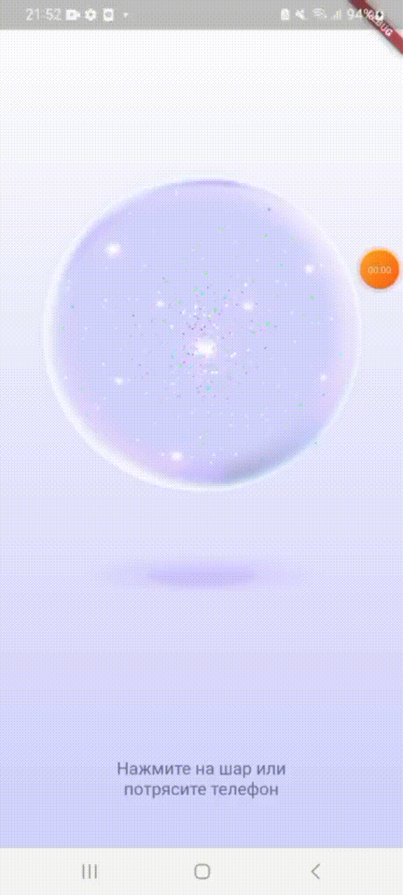

# Целевая платформа
Приложение разрабатывалось под мобильные устройства, планшеты и веб-браузеры. Не было протестировано под ios.

# Результаты
В приложении реализованы:
 - интерфейс с магическим шаром, парящим вверх вниз и отбрасывающим цветную тень
 - получение ответа на мысленно заданный вопрос с помощью нажатия на шар или тряски телефона или планшета
 - отображение текста внутри шара в случае успешного получения ответа
 - появление текста с сообщением об ошибке и покраснение шара в случае ошибки
 - сотрясение и затемнение/подсвечивание шара внутри при выполнении запроса 
 - анимация появления текста из прозрачности
 - светлая и темная темы, которые переключаются при изменении режима в настройках телефона
 - адаптация под планшеты и веб-платформы

# Демонстрация работы

## Мобильные устройства

### Светлая тема

</img>
</img>

### Темная тема

</img>
</img>

